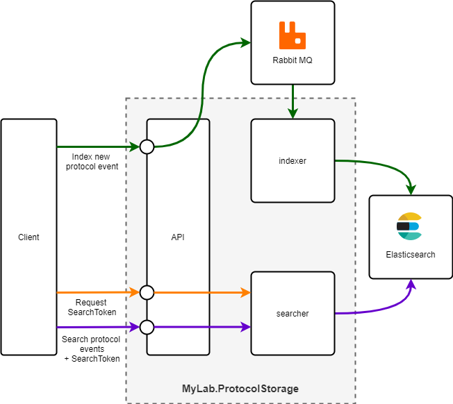

# MyLab.ProtocolStorage

Ознакомьтесь с последними изменениями в [журнале изменений](/CHANGELOG.md).

Docker:  [](https://github.com/mylab-search-fx/protocol-storage/pkgs/container/protocol-storage-api) [](https://github.com/mylab-search-fx/protocol-storage/pkgs/container/protocol-storage-indexer) [](https://github.com/mylab-search-fx/protocol-storage/pkgs/container/protocol-storage-searcher)

Спецификация `API` : [](https://app.swaggerhub.com/apis/ozzy/MyLab.ProtocolStorage/1)

Клиент: [](https://www.nuget.org/packages/MyLab.ProtocolStorage.Client/)

## Обзор

`MyLab.ProtocolStorage` - хранилище протоколов. Обеспечивает хранение и поиск событий протоколов. 

*Протокол* - упорядоченная во времени последовательность событий, неизменняемых со временем. 

*Событие протокола* - сущность произвольного содержания за исключением служебных полей.



Состав решения:
* `API` - `REST-API` для получения доступа к функциям хранилища;
* `indexer` - индексатор событий протокола. Разработан на базе [MyLab.Search.Indexer](https://github.com/mylab-search-fx/indexer);
* `searcher` - поисковик событий протокола. Разработан на базе [MyLab.Search.Searcher](https://github.com/mylab-search-fx/searcher).

## Сценарии

### Ведение протокола

Ведение протокола осуществляется следующим образом:
* клиент (служба, ведущая протокол) обращается к `API хранилища протоколов` и отправляет объект, описывающий событие, которое необходимо зафиксировать в протоколе;
* `API хранилища протоколов` помещает объект события в очередь;
* клиент продолжает свою работу;
* `indexer` забирает объект события и индексирует его в `Elasticsearch`.

### Поиск по протоколу

Поиск по протоколу осуществляется следующим образом:
* служба, предоставляющая протокол клиенту:
  *  определяет содержание выборки по субъекту. Например, для обычного пользователя - только записи, принадлежание ему, а для администратора - записи всех пользователей; 
  * запрашивает у `API хранилища протоколов` токен поиска с указанием ограничений по субъекту;
  * передаёт токен поиска клиенту;
* клиент, делает запрос поиска с параметрами поиска и токеном поиска в `API хранилища протоколов` и получает выборку событий протокола.

## Протокол

*Протокол* - абстракция, объединяющая события одного типа. Фактически, в хранящемся виде протокол представляет из себя индекс или [поток](https://www.elastic.co/guide/en/elasticsearch/reference/7.17/data-streams.html) в `Elasticsearch`. Через `API хранилища протоколов` возможно только добавление новых событий в протокол. Для очистки протокола необходимо использовать [поток](https://www.elastic.co/guide/en/elasticsearch/reference/7.17/data-streams.html) и подходы по их чистке.

`API хранилища протоколов` подерживает любое количество протоколов без предварительного их создания. Протокол создаётся в момент добавления в него первого события. 

## Событие протокола

*Событие протокола* - объект, содержащий реквизиты бизнес-события, необходимые для участия в условиях выборки и для обеспечения состава выбранных данных. Проиндексированное событие не изменяется со временем.

Служебные поля:
* `id` - идентификатор события. Если не указан, устанавилвается случайный GUID в формате 32 символа (без разделителей) с нижнем регистре. Например: `b6738a45784f4fb1b7b15d747e1c72fb`;
* `subject` - субъект события. Например, идентификатор пользователя;
* `datetime` - дата и время возникновения события. Если не указано, устанавливается текущие дата и время;
* `type` - тип события.

Все служебные поля необязательны. 

## Поиск

Подробнее обо всех возможностях поиска [тут](https://github.com/mylab-search-fx/searcher#%D0%B7%D0%B0%D0%BF%D1%80%D0%BE%D1%81-%D0%BF%D0%BE%D0%B8%D1%81%D0%BA%D0%B0).

Результаты выборки по умолчанию сортируются в порядке сначала более свежие по дате+времени, указанным в событиях протокола. 

### Предустановленные фильтры

#### Фильтр `by-id` 

Фильтр по идентификатору события. 

Аргументы:
  * `id` - идентификатор события;

#### Фильтр `by-subject`
Фильтр по субъекту. 

Аргументы:
  * `subject` - идентификатор субъекта;

#### Фильтр `by-dt`

Фильтр по дате+времени, указанным в событиях. 

Аргументы:
  * `from` - больше или равно указанным дате+времени
  * `to` - меньше указанных даты+времени

#### Фильтр `by-type`
Фильтр по типу события. 

Аргументы:
  * `type` - тип события;

## Развёртывание

В данном разделе описывается вариант развёртывания на базе `Docker` с применением `docker-compose`.

Пример `docker-compose.yml`:

```yml
version: '3.2'

services:

  test-indexer:
    container_name: test-indexer
    image: ghcr.io/mylab-search-fx/protocol-storage-indexer:latest
    environment:
      MQ__Host: rabbitmq-host
      MQ__User: your-mq-username-here
      MQ__Password: your-mq-password-here
      ES__Url: http://elasticsearch-host:9200
      Indexer__MqQueue: your-queue-name
      Indexer__EsIndexNamePrefix: test-

  test-searcher:
    container_name: mps-searcher
    image: ghcr.io/mylab-search-fx/protocol-storage-searcher:latest
    environment:
      ES__Url: http://elasticsearch-host:9200
      Searcher__Token__ExpirySec: 10
      Searcher__Token__SignKey: your-sign-key-here
      Searcher__EsIndexNamePrefix: test-

  test-api:
    container_name: test-api
    image: ghcr.io/mylab-search-fx/protocol-storage-api:latest
    environment:
      MQ__Host: rabbitmq-host
      MQ__User: your-mq-username-here
      MQ__Password: your-mq-password-here
      MQ__DefaultPub__RoutingKey: your-queue-name
      API__List__indexer__Url: http://test-indexer
      API__List__searcher__Url: http://test-searcher
```

## Конфигурация

### Конфигурация `indexer`
* `MQ` - параметры подключения к RabbitMQ ([подробнее](https://github.com/mylab-tools/rabbit-client#%D0%BF%D0%B0%D1%80%D0%B0%D0%BC%D0%B5%D1%82%D1%80%D1%8B-%D0%BA%D0%BE%D0%BD%D1%84%D0%B8%D0%B3%D1%83%D1%80%D0%B0%D1%86%D0%B8%D0%B8))
  * `Host` - хост подключения;
  * `VHost` - виртуальный хост
  * `Port` - порт. 5672 - по умолчанию;
  * `User` - имя пользователя;
  * `Password` - пароль;
* `ES` - параметры подключения к `Elasticsearch`
  * `Url` - url подключения к `Elasticsearch`
* `Indexer` - настройуки индексатора ([подробнее](https://github.com/mylab-search-fx/indexer#indexer-%D0%BD%D0%B0%D1%81%D1%82%D1%80%D0%BE%D0%B9%D0%BA%D0%B8-%D0%BB%D0%BE%D0%B3%D0%B8%D0%BA%D0%B8-%D0%B8%D0%BD%D0%B4%D0%B5%D0%BA%D1%81%D0%B8%D1%80%D0%BE%D0%B2%D0%B0%D0%BD%D0%B8%D1%8F))
  * `MqQueue` - имя очереди в RabbitMQ для входящих сообщений индексации;
  * `EsIndexNamePrefix` - префикс, который будет добавляться к имени индекса `Elasticsearch` всех индексов (будет переведён в нижний регистр);
  * `EsIndexNamePostfix` - постфикс, который будет добавляться к имени индекса `Elasticsearch` всех индексов (будет переведён в нижний регистр).

Больше возможностей по настройке индексатора [тут](https://github.com/mylab-search-fx/indexer#%D0%BA%D0%BE%D0%BD%D1%84%D0%B8%D0%B3%D1%83%D1%80%D0%B8%D1%80%D0%BE%D0%B2%D0%B0%D0%BD%D0%B8%D0%B5).

### Конфигурация `searcher`
* `ES` - параметры подключения к `Elasticsearch`
  * `Url` - url подключения к `Elasticsearch`
* `Searcher` - настройуки поисковика ([подробнее](https://github.com/mylab-search-fx/searcher#%D0%BA%D0%BE%D0%BD%D1%84%D0%B8%D0%B3%D1%83%D1%80%D0%B0%D1%86%D0%B8%D1%8F)):
  * `Token` - настройки использования токенов:
  * `ExpirySec` - (опционально) время жизни токена в секундах;
  * `SignKey` - текстовый ключ подписи токена. Должен быть не меньше 16 байт;
  * `EsIndexNamePrefix` - префикс, который будет добавляться к имени индекса `Elasticsearch` всех индесов поисковика;
  * `EsIndexNamePostfix` - постфикс, который будет добавляться к имени индекса `Elasticsearch` всех индексов поисковика;
  * `Debug` - флаг, определяющий добавление отладочной информации о поиске в Elasticsearch ([подробнее об отладке](https://github.com/mylab-search-fx/searcher#%D0%9E%D1%82%D0%BB%D0%B0%D0%B4%D0%BA%D0%B0-%D0%B7%D0%B0%D0%BF%D1%80%D0%BE%D1%81%D0%BE%D0%B2-%D0%BF%D0%BE%D0%B8%D1%81%D0%BA%D0%B0)).

Больше возможностей по настройке поисковика [тут](https://github.com/mylab-search-fx/searcher#%D0%BA%D0%BE%D0%BD%D1%84%D0%B8%D0%B3%D1%83%D1%80%D0%B0%D1%86%D0%B8%D1%8F).

### Конфигурация `api`
* `MQ` - параметры подключения к RabbitMQ ([подробнее](https://github.com/mylab-tools/rabbit-client#%D0%BF%D0%B0%D1%80%D0%B0%D0%BC%D0%B5%D1%82%D1%80%D1%8B-%D0%BA%D0%BE%D0%BD%D1%84%D0%B8%D0%B3%D1%83%D1%80%D0%B0%D1%86%D0%B8%D0%B8))
  * `Host` - хост подключения;
  * `VHost` - виртуальный хост
  * `Port` - порт. 5672 - по умолчанию;
  * `User` - имя пользователя;
  * `Password` - пароль;
* `API` - настройки подключения к другим API ([подробнее](https://github.com/mylab-tools/apiclient#%D0%BA%D0%BE%D0%BD%D1%84%D0%B8%D0%B3%D1%83%D1%80%D0%B8%D1%80%D0%BE%D0%B2%D0%B0%D0%BD%D0%B8%D0%B5))
  * `List` - список конфигураций подключений
    * `indexer` - параметры подключения к индексатору
      * `Url` - url индексатора
    * `searcher` - параметры подключения к поисковику
      * `Url` - url поисковика

## Клиент

Для применения в `.NET` проектах разработана библиотека с клиентскими средствами для работы с `MyLab.ProtocolStorage` - [](https://www.nuget.org/packages/MyLab.ProtocolStorage.Client/)

### Контракты 

Библиотека содержит контракты конечных точек `MyLab.ProtocolStorage`, разработанные на базе [MyLab.ApiClient](https://github.com/mylab-tools/apiclient). Эти контракты можно использовать, чтобы работать с сервисом `MyLab.ProtocolStorage` как с объектной моделью.

Контракт `API` для создания токена поиска:

```C#
/// <summary>
/// The token API contract
/// </summary>
[Api("v1/search-token", Key = "protocol-storage-token")]
public interface ITokenApiV1
{
    /// <summary>
    /// Creates token to search for protocol items without restrictions
    /// </summary>
    [Post("total")]
    Task<string> CreateTotalTokenAsync();

    /// <summary>
    /// Creates token to search for protocol items which owned by specified subject
    /// </summary>
    [Post("for-subject/{subjectId}")]
    Task<string> CreateTokenForSubjectAsync([Path]string subjectId);
}
```

Контракт `API` для работы с событиями протокола:

```C#
/// <summary>
/// The protocols API contract
/// </summary>
[Api("v1/protocols", Key = "protocol-storage-protocols")]
public interface IProtocolApiV1
{
    /// <summary>
    /// Pushes event into specified protocol
    /// </summary>
    [Post("{protocolId}/collector")]
    Task PostEventAsync([Path]string protocolId, [JsonContent] ProtocolEvent eventObj);

    /// <summary>
    /// Searches for specified protocol items
    /// </summary>
    [Post("{protocolId}/searcher")]
    Task<SearchResult> SearchAsync([Path] string protocolId, [JsonContent] ClientSearchRequest request, [Header("X-Search-Token")] string searchToken);
}
```

### Безопасный индексатор

Безопасный индексатор `SafeProtocolIndexerV1` - класс, обеспечивающий сокрытие возможных ошибок во время индексирования события протокола. Главной мотивацией создания такого инструмента является подход, при котором ведение протокола не должно влиять на основную функциональность.

Для использования безопасного индексатора необходимо его создать и передать:
* объект `API` протоколов (`IProtocolApiV1`)
* [DSL-логгер](https://github.com/mylab-log/log-dsl) (опционально)

```C#
class TestProtocolEvent : ProtocolEvent
{
    public string Account { get; set; }
    public string Action { get; set; }
}

var indexer = new SafeProtocolIndexerV1(api, dslLogger);

var eventObj = new TestProtocolEvent
{
    Account = "ololo@mytest.com",
    Action = "login"
};

await indexer.PostEventAsync("foo", eventObj);
```

Пример лога об ошибке:

```yml
Message: Protocol writing error
Time: 2022-08-17T20:20:53.436
Labels:
  log_level: error
Facts:
  protocol-id: foo
  event-obj:
    Account: ololo@mytest.com
    Action: login
Exception:
  Message: Exception of type 'System.Exception' was thrown.
  Type: System.Exception
  StackTrace: >2-
        at Moq.Behaviors.ThrowException.Execute(Invocation invocation) in C:\projects\moq4\src\Moq\Behaviors\ThrowException.cs:line 22
        at Moq.MethodCall.ExecuteCore(Invocation invocation) in C:\projects\moq4\src\Moq\MethodCall.cs:line 110
        at Moq.Setup.Execute(Invocation invocation) in C:\projects\moq4\src\Moq\Setup.cs:line 84
        at Moq.FindAndExecuteMatchingSetup.Handle(Invocation invocation, Mock mock) in C:\projects\moq4\src\Moq\Interception\InterceptionAspects.cs:line 95
        at Moq.Mock.Moq.IInterceptor.Intercept(Invocation invocation) in C:\projects\moq4\src\Moq\Interception\Mock.cs:line 17
        at Moq.CastleProxyFactory.Interceptor.Intercept(IInvocation underlying) in C:\projects\moq4\src\Moq\Interception\CastleProxyFactory.cs:line 107
        at Castle.DynamicProxy.AbstractInvocation.Proceed()
        at Castle.Proxies.IProtocolApiV1Proxy.PostEventAsync(String protocolId, ProtocolEvent eventObj)
        at MyLab.ProtocolStorage.Client.SafeProtocolIndexerV1.PostEventAsync(String protocolId, ProtocolEvent eventObj) in C:\Users\ozzye\Documents\prog\my\mylab-search-fx\protocol-storage\src\MyLab.ProtocolStorage.Client\SafeProtocolIndexerV1.cs:line 40
```
